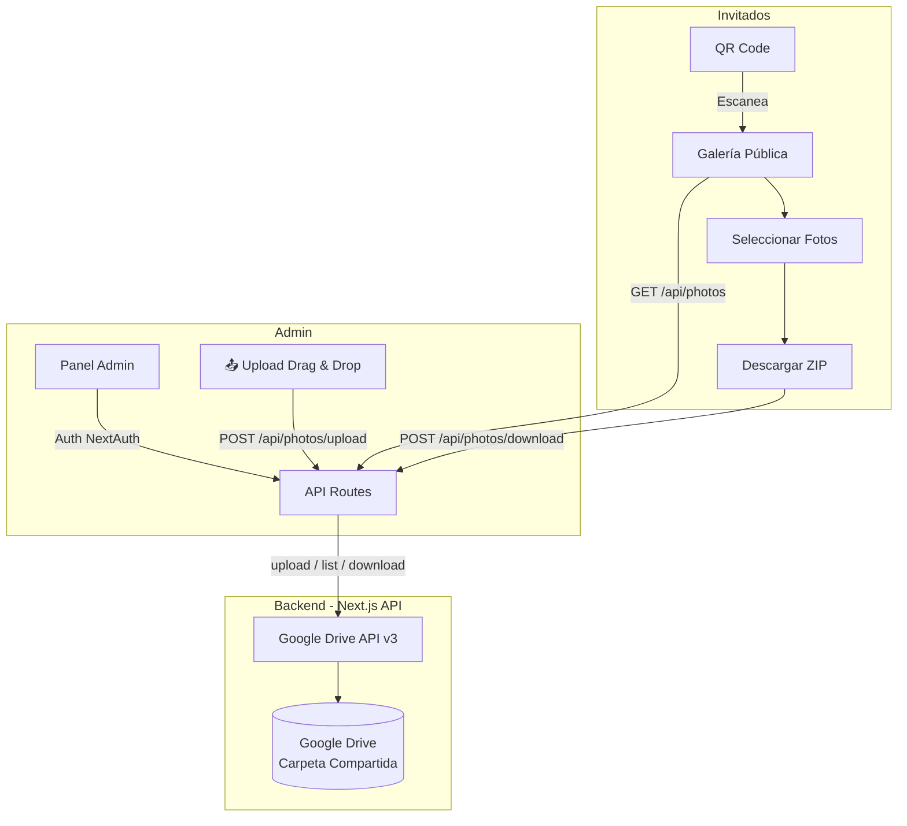

# 💒 Wedding Photos App — Plan de Implementación

Aplicación web para compartir fotos de boda, donde un administrador **sube fotos directamente desde el panel admin** (drag-and-drop) a Google Drive, y los invitados las visualizan, seleccionan y descargan mediante un QR code.

## Decisiones de Diseño

### Arquitectura General



### Stack Tecnológico

| Tecnología | Propósito |
|:---|:---|
| **Next.js 14** (App Router) | Framework principal |
| **NextAuth.js v5** (Auth.js) | Autenticación admin (Google OAuth) |
| **Google Drive API v3** | Almacenamiento de fotos (OAuth 2.0) |
| **`qrcode.react`** | Generación de QR codes |
| **JSZip** | Descarga múltiple en ZIP |
| **CSS Modules** | Estilos con diseño premium |
| **`next/image`** | Optimización de imágenes |

### Estrategia de Despliegue

| Plataforma | Modo | Funcionalidad |
|:---|:---|:---|
| **Vercel** (Principal) | Full SSR + API Routes | ✅ Completa: admin, galería, descarga, Google Drive |
| **GitHub Pages** (Fallback) | Static Export (`output: 'export'`) | ⚠️ Solo galería estática (pre-renderizada al build). Sin admin, sin API en vivo |

> [!IMPORTANT]
> **GitHub Pages** no soporta API Routes ni servidor Node.js. Para el fallback estático, se pre-generará la galería con las fotos existentes al momento del build. La administración y descarga dinámica solo funcionarán en Vercel.

### Google Drive — OAuth 2.0 a nombre del administrador

La app se autentica con la **cuenta de Google real** del administrador (sin
requerir login de los invitados a Google):
1. El administrador inicia sesión en el panel con su cuenta de Google
2. El admin sube fotos desde el panel web → API Route → Google Drive API `files.create`
3. La app lista las fotos de esa carpeta via API
4. Las fotos se sirven como proxy a través de API Routes (evita problemas de CORS y links expirados)

> [!IMPORTANT]
> **No se usa una cuenta de servicio.** Las Service Accounts no tienen cuota de
> almacenamiento (`storageQuota.limit = 0`) y Google no les permite ser
> propietarias de un archivo, por lo que cada subida fallaba con `403 Service
> Accounts do not have storage quota`. Compartir una carpeta con la cuenta de
> servicio solo funciona si la carpeta está en un dominio de **Google
> Workspace**; en una cuenta personal `@gmail.com` el archivo acaba en la "My
> Drive" de la cuenta de servicio, que no tiene espacio. Con OAuth la app usa la
> cuenta del administrador y las fotos consumen su cuota (15 GB).

---

## User Review Required

> [!WARNING]
> **Acceso del Admin**: No hay contraseña. El admin entra con su cuenta de Google mediante OAuth y `src/auth.ts` solo admite el email de `ADMIN_EMAIL`. NO se usará base de datos. Si en el futuro necesitas múltiples admins, se requerirá migrar a una DB.

> [!IMPORTANT]
> **Google Cloud Setup**: Antes de ejecutar la app necesitarás:
> 1. Crear un proyecto en Google Cloud Console
> 2. Habilitar la Google Drive API
> 3. Configurar la pantalla de consentimiento OAuth y **publicarla** (en modo *Testing* los refresh tokens caducan a los 7 días)
> 4. Crear un cliente OAuth 2.0 de tipo *Aplicación web* con dos URIs de redirección autorizados: `http://localhost:8765` (para el script del refresh token) y `http://localhost:3000/api/auth/callback/google` (para el login)
> 5. Generar `GOOGLE_REFRESH_TOKEN` con `npm run drive:token`
> 6. Poner el `GOOGLE_DRIVE_FOLDER_ID` de la carpeta que contiene las fotos

---

## Open Questions

> [!NOTE]
> 1. **¿Quieres algún tema de color/branding específico para la boda?** (Por defecto usaré una paleta elegante: dorado, crema, negro con acentos florales)
> 2. **¿Las fotos están organizadas en subcarpetas en Google Drive o todas en una sola carpeta?** (Afecta si mostramos categorías/álbumes)
> 3. **¿Necesitas soporte multi-idioma (español/inglés)?** (Por defecto haré la interfaz en español)

---

## Proposed Changes

### Estructura del Proyecto

```
c:\Desarrollo\wedding-photos-app\
├── .env.local.example          # Template de variables de entorno
├── .github/
│   └── workflows/
│       └── deploy-ghpages.yml  # GitHub Actions para deploy estático
├── next.config.js              # Configuración Next.js (export condicional)
├── package.json
├── public/
│   └── fonts/                  # Tipografías locales (Playfair Display, Inter)
├── src/
│   ├── auth.ts                 # Configuración NextAuth.js v5
│   ├── middleware.ts           # Protección de rutas /admin
│   ├── app/
│   │   ├── layout.tsx          # Layout raíz con providers
│   │   ├── page.tsx            # Landing / Redirect a galería
│   │   ├── globals.css         # Design system global
│   │   │
│   │   ├── gallery/
│   │   │   ├── page.tsx        # 📸 Galería pública (invitados)
│   │   │   └── components/
│   │   │       ├── PhotoGrid.tsx
│   │   │       ├── PhotoModal.tsx
│   │   │       ├── SelectionBar.tsx
│   │   │       └── DownloadButton.tsx
│   │   │
│   │   ├── admin/
│   │   │   ├── layout.tsx      # Layout protegido
│   │   │   ├── page.tsx        # 🔐 Dashboard admin
│   │   │   └── components/
│   │   │       ├── PhotoUploader.tsx   # 📤 Drag & drop upload
│   │   │       ├── UploadProgressBar.tsx
│   │   │       ├── FolderConfig.tsx
│   │   │       ├── QRGenerator.tsx
│   │   │       ├── PhotoManager.tsx
│   │   │       └── StatsPanel.tsx
│   │   │
│   │   ├── login/
│   │   │   └── page.tsx        # Página de login
│   │   │
│   │   └── api/
│   │       ├── auth/[...nextauth]/
│   │       │   └── route.ts    # NextAuth route handler
│   │       ├── photos/
│   │       │   └── route.ts    # GET: listar | POST: subir fotos
│   │       ├── photos/[id]/
│   │       │   └── route.ts    # GET: proxy | DELETE: eliminar
│   │       ├── photos/upload/
│   │       │   └── route.ts    # POST: upload a Google Drive
│   │       ├── photos/download/
│   │       │   └── route.ts    # POST: descarga múltiple (ZIP)
│   │       └── drive/
│   │           └── folders/
│   │               └── route.ts # GET: listar carpetas de Drive
│   │
│   ├── lib/
│   │   ├── google-drive.ts     # Cliente Google Drive API
│   │   ├── utils.ts            # Utilidades generales
│   │   └── constants.ts        # Constantes de la app
│   │
│   ├── components/
│   │   ├── ui/                 # Componentes UI reutilizables
│   │   │   ├── Button.tsx
│   │   │   ├── Modal.tsx
│   │   │   ├── Spinner.tsx
│   │   │   ├── Toast.tsx
│   │   │   └── Input.tsx
│   │   ├── Header.tsx
│   │   └── Footer.tsx
│   │
│   └── types/
│       └── index.ts            # Tipos TypeScript
│
└── README.md                   # Documentación de setup y deploy
```

---

### 1. Configuración Base del Proyecto

#### [NEW] `package.json`
- Next.js 14, React 18, TypeScript
- Dependencias: `googleapis`, `next-auth@beta`, `qrcode.react`, `jszip`, `zod`
- Scripts: `dev`, `build`, `start`, `drive:token` (para GitHub Pages)

#### [NEW] `next.config.js`
- Configuración de `images` con dominios permitidos (`drive.google.com`)
- Export condicional vía `NEXT_PUBLIC_STATIC_EXPORT` env var
- `basePath` configurable para GitHub Pages

#### [NEW] `.env.local.example`
```env
# Auth
AUTH_SECRET=
ADMIN_EMAIL=

# Google Drive (OAuth 2.0)
GOOGLE_CLIENT_ID=
GOOGLE_CLIENT_SECRET=
GOOGLE_REFRESH_TOKEN=
GOOGLE_DRIVE_FOLDER_ID=

# App
NEXT_PUBLIC_APP_URL=http://localhost:3000
NEXT_PUBLIC_WEDDING_TITLE="Boda de..."
NEXT_PUBLIC_WEDDING_DATE="2026-12-15"
```

---

### 2. Autenticación (NextAuth.js v5 + Google OAuth)

#### [NEW] `src/auth.ts`
- Provider: Google (OAuth 2.0), sin contraseña
- Callback `signIn` que solo admite el email de `ADMIN_EMAIL`
- `access_type=offline` + `prompt=consent` para obtener el refresh token
- Alcance `https://www.googleapis.com/auth/drive` completo, para poder gestionar
  también las fotos que ya había en la carpeta
- Estrategia JWT

#### [NEW] `src/proxy.ts`
- Protección de rutas `/admin/*`
- Redirect a `/login` si no autenticado

#### [NEW] `src/app/login/page.tsx`
- Botón «Continuar con Google»
- Mensaje indicando que solo entra la cuenta propietaria de la carpeta

#### [NEW] `scripts/get-google-refresh-token.mjs`
- Flujo OAuth local en el puerto 8765
- Canjea el código y muestra la cuenta, su cuota y el `GOOGLE_REFRESH_TOKEN`

---

### 3. Google Drive Integration

#### [NEW] `src/lib/google-drive.ts`
- Cliente `OAuth2` de `googleapis` construido con `GOOGLE_REFRESH_TOKEN`; la
  librería renueva el access token de forma transparente. Se cachea un cliente
  por refresh token
- `listPhotos(folderId)`: Lista imágenes de una carpeta
- `uploadPhoto(file, folderId)`: **Sube una foto a Google Drive** usando `drive.files.create` con `multipart` upload
- `deletePhoto(fileId)`: Elimina una foto de Google Drive
- `getPhotoStream(fileId)`: Obtiene stream de una foto para proxy
- `listFolders()`: Lista subcarpetas (para admin)
- `getPhotoMetadata(fileId)`: Metadata individual
- Manejo de paginación (Drive API devuelve máx 1000 por página)
- Tipos TypeScript para respuestas

#### [NEW] `src/app/api/photos/route.ts`
- `GET`: Lista fotos con thumbnail URLs proxied
- Query params: `page`, `limit`, `folder`
- Respuesta: `{ photos: Photo[], nextPageToken, total }`

#### [NEW] `src/app/api/photos/upload/route.ts`
- `POST`: **Recibe fotos desde el admin y las sube a Google Drive**
- Acepta `multipart/form-data` con múltiples archivos
- Validación: solo imágenes (JPEG, PNG, WebP, HEIC), máx 25MB por archivo
- Protegido: requiere sesión admin activa (verificación NextAuth)
- Respuesta: `{ uploaded: PhotoMetadata[], errors: UploadError[] }`
- Procesa archivos en paralelo con concurrencia limitada (3 simultáneos)

#### [NEW] `src/app/api/photos/[id]/route.ts`
- `GET`: Proxy de imagen individual desde Google Drive
- `DELETE`: Elimina foto de Google Drive (solo admin autenticado)
- Headers de cache apropiados
- Soporta query param `size=thumb|medium|full`

#### [NEW] `src/app/api/photos/download/route.ts`
- `POST`: Recibe array de IDs de fotos
- Genera ZIP server-side con las fotos seleccionadas
- Stream de respuesta para evitar timeout en archivos grandes

---

### 4. Vista Pública — Galería de Invitados

#### [NEW] `src/app/gallery/page.tsx`
- Grid de fotos responsivo con efecto masonry
- Carga infinita (infinite scroll)
- Búsqueda/filtro por carpeta si hay subcarpetas

#### [NEW] `src/app/gallery/components/PhotoGrid.tsx`
- Grid CSS con animaciones de entrada (fade-in staggered)
- Lazy loading con `IntersectionObserver`
- Checkbox de selección superpuesto en cada foto
- Efecto hover con escala y sombra

#### [NEW] `src/app/gallery/components/PhotoModal.tsx`
- Lightbox a pantalla completa
- Navegación con flechas (teclado + swipe en móvil)
- Botón de descarga individual
- Información de la foto (nombre, fecha)

#### [NEW] `src/app/gallery/components/SelectionBar.tsx`
- Barra flotante inferior cuando hay fotos seleccionadas
- Contador de fotos seleccionadas
- Botones: "Seleccionar todas", "Limpiar selección", "Descargar seleccionadas"
- Animación slide-up

#### [NEW] `src/app/gallery/components/DownloadButton.tsx`
- Descarga ZIP de fotos seleccionadas
- Barra de progreso durante la descarga
- Usa JSZip en cliente (fetch de cada foto + zip)

---

### 5. Vista Admin — Dashboard

#### [NEW] `src/app/admin/page.tsx`
- Dashboard con estadísticas, upload y configuración
- Protegido por NextAuth middleware
- Layout con tabs/secciones: **Subir Fotos** | Gestionar | QR Code | Configuración

#### [NEW] `src/app/admin/components/PhotoUploader.tsx` ⭐
- **Zona de arrastre (drag & drop)** con feedback visual:
  - Estado idle: borde punteado dorado con icono de cámara
  - Estado drag-over: borde sólido, fondo highlight, animación pulse
  - Estado uploading: barra de progreso global
  - Estado completado: check animado con resumen
- También soporta **click para seleccionar archivos** (input file hidden)
- **Previsualización de thumbnails** antes de subir (FileReader API)
- Validación client-side:
  - Tipos permitidos: JPEG, PNG, WebP, HEIC
  - Tamaño máximo: 25MB por archivo
  - Muestra errores inline por archivo inválido
- **Carga en lotes**: sube múltiples fotos simultáneamente
- Botón "Subir todas" / "Cancelar" / "Limpiar"
- Opción de agregar más fotos sin limpiar las existentes

#### [NEW] `src/app/admin/components/UploadProgressBar.tsx`
- Barra de progreso individual por cada archivo
- Estados visuales: pendiente (gris), subiendo (dorado animado), completado (verde ✓), error (rojo ✗)
- Muestra nombre del archivo + tamaño + porcentaje
- Botón de reintentar en caso de error
- Animación de progreso fluida con CSS transitions

#### [NEW] `src/app/admin/components/FolderConfig.tsx`
- Configurar ID de carpeta de Google Drive
- Previsualización de fotos en la carpeta seleccionada
- Validación de acceso a la carpeta

#### [NEW] `src/app/admin/components/QRGenerator.tsx`
- Genera QR code con la URL de la galería pública
- Opciones de personalización (tamaño, color)
- Botón para descargar QR como PNG/SVG
- Preview del QR en tiempo real

#### [NEW] `src/app/admin/components/PhotoManager.tsx`
- Grid de fotos existentes con opción de **eliminar** (con confirmación)
- Previsualización rápida
- Indicador de estado de sincronización con Drive
- Selección múltiple para eliminación en lote

#### [NEW] `src/app/admin/components/StatsPanel.tsx`
- Total de fotos
- Espacio utilizado en Drive
- Carpeta actual configurada
- Estado de conexión con Google Drive
- Última carga realizada (timestamp)

---

### 6. Design System & UI

#### [NEW] `src/app/globals.css`
- **Paleta**: Dorado (#D4A574), Crema (#FFF8F0), Negro suave (#1a1a2e), Rosa pálido (#f5e6e0)
- **Tipografía**: Playfair Display (headings) + Inter (body) vía Google Fonts
- **Glassmorphism**: Paneles con `backdrop-filter: blur()`
- **Animaciones**: Fade-in, slide-up, shimmer (skeleton loading)
- **Dark mode**: Soporte automático con `prefers-color-scheme`
- **Variables CSS** para theming consistente

#### [NEW] `src/components/ui/*.tsx`
- Componentes base: Button, Modal, Spinner, Toast, Input
- Variantes: primary (dorado), secondary, ghost, danger
- Micro-animaciones en interacciones

---

### 7. Landing Page

#### [NEW] `src/app/page.tsx`
- Página de bienvenida elegante con nombres de los novios
- Fecha y lugar de la boda
- Botón prominente "Ver Galería de Fotos"
- Animaciones de entrada (parallax suave)
- Responsive (mobile-first)

---

### 8. Despliegue

#### [NEW] `.github/workflows/deploy-ghpages.yml`
- GitHub Action para build estático y deploy a GitHub Pages
- Ejecuta `next build` con `output: 'export'`
- Configura `basePath` automáticamente

#### [NEW] `vercel.json`
- Configuración de headers de seguridad
- Variables de entorno requeridas documentadas

#### [NEW] `README.md`
- Guía de setup de Google Cloud
- Instrucciones de deploy en Vercel
- Instrucciones de deploy en GitHub Pages
- Variables de entorno explicadas

---

## Verification Plan

### Automated Tests
```bash
# Build del proyecto
npm run build

# Verificar que compila sin errores
npm run lint

# Verificar export estático (GitHub Pages)
NEXT_PUBLIC_STATIC_EXPORT=true npm run build
```

### Manual Verification
1. **Login admin**: Verificar flujo de autenticación con credenciales
2. **Upload fotos**: Verificar drag-and-drop, validación de archivos, progreso y subida exitosa a Google Drive
3. **Eliminar fotos**: Verificar eliminación individual y en lote desde el admin
4. **Galería pública**: Verificar carga de fotos, selección y descarga
5. **QR Code**: Verificar que el QR generado apunta a la URL correcta
6. **Responsive**: Verificar en mobile, tablet y desktop
7. **Google Drive**: Verificar listado, thumbnails, upload y descarga de fotos
8. **GitHub Pages**: Verificar build estático y navegación
